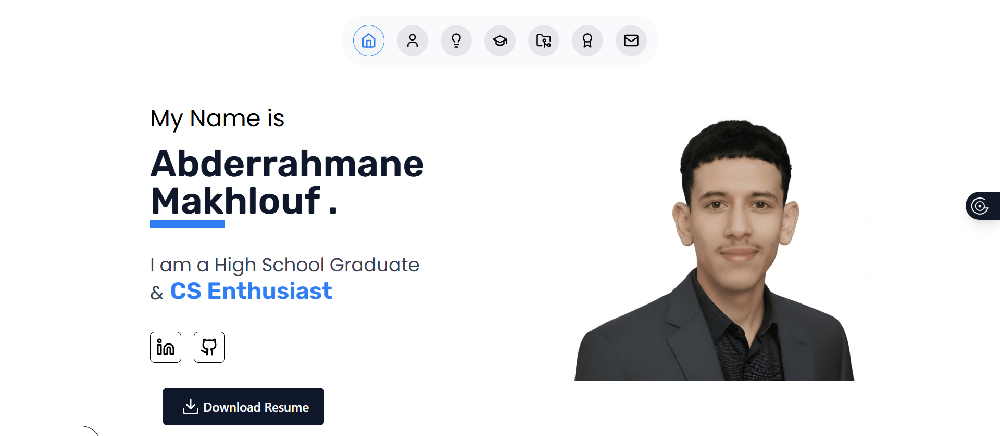

# 🌐 Personal Portfolio

Customized a modern and responsive **personal portfolio website** built with **Next.js**, **TailwindCSS**, and **Framer Motion**.  
It highlights my technical certifications, education, and IT projects through a clean and animated interface.

---

## 🚀 Features

- Fully responsive design for all screen sizes  
- Animated transitions using **Framer Motion**  
- Dynamic sections: **Education**, **Projects**, **Certifications**, and **Contact**  
- Contact form with integrated email functionality  
- Modern UI powered by **shadcn/ui** and **Lucide Icons**

---

## 🛠️ Tech Stack

| Category        | Technologies |
|-----------------|-------------|
| **🖥 Framework**      | Next.js (App Router), React, TypeScript |
| **🎨 Styling**       | TailwindCSS |
| **🧩 UI Components** | shadcn/ui, Lucide Icons |
| **✨ Animations**    | Framer Motion |
| **🚀 Deployment**    | Vercel |


---

## ⚙️ Installation & Setup

To run the project locally:

```bash
# Clone the repository
git clone https://github.com/abderrahmanemakhlouf/portfolio.git

# Go to the project folder
cd portfolio

# Install dependencies
npm install

# Run the development server
npm run dev
